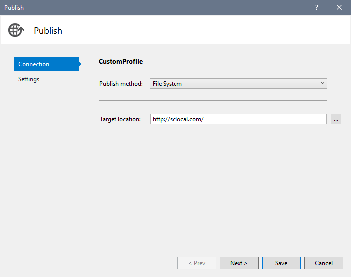
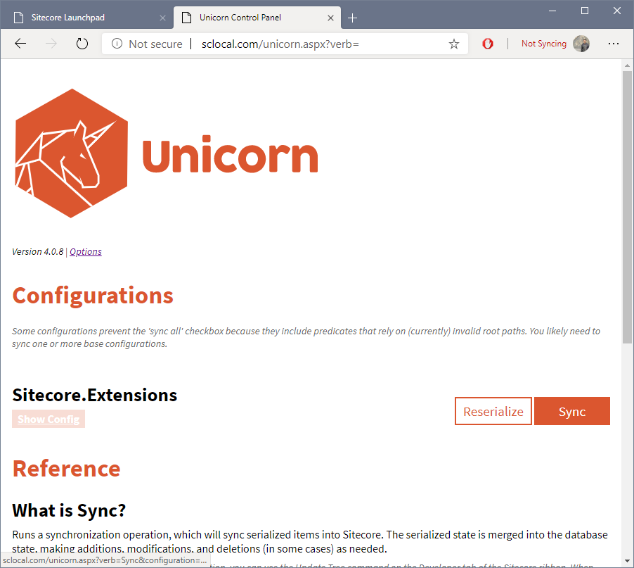

# How to contribute
To contribute with new features or fixes, please complete the developer setup.

## Developer setup

### Requirements
- Visual Studio 2017 or superior
- A clean installation of Sitecore 8.0. Please, consider [SIM](http://dl.sitecore.net/updater/sim/) for quick installation.
- [Sitecore Powershell Extensions](https://doc.sitecorepowershell.com/installation)

### Get the repository
Clone the repository in a local folder.
``` 
git clone https://github.com/andresvillenas/Sitecore.Extensions.git
```

### Installation
- Open the **Sitecore.Extensions.sln** solution
- Modify the Publish settings to point to the local installation of Sitecore.

- Modify the attribute **physicalRootPath** at the **/configuration/sitecore/unicorn/configurations/configuration[name="Sitecore.Extensions"]** of the **Unicorn.Configs.Default.config** file to point to the **Serialized** folder of the source code. *Required to synchronize the items of the module in the local instance.*
- Publish the Sitecore.Extensions project.
- Go to the **/Unicorn.aspx** page and click over the **Sync** button of Sitecore.Extensions configuration.


## How to create a new feature
1. The location of the code will depend on the section of Sitecore that is going to be extended. For instance, the JumpList module is inside of the content tree of the Content Editor, therefore, the code was placed in the following namespace **Sitecore.Extensions.ContentEditor.ContentTree.JumpList**. 
2. Create the required classes to complete the desired functionality.
3. If the new feature requires new items (like templates, or content) or changes in the existing ones, they must be tracked using a new Unicorn configuration file. The file must be created inside of the **\App_Config\Include\zSitecoreExtensions**
4. If the new feature requires new Javascript or CSS files, they must be added to the **\sitecore\shell\Applications\Extensions** folder.