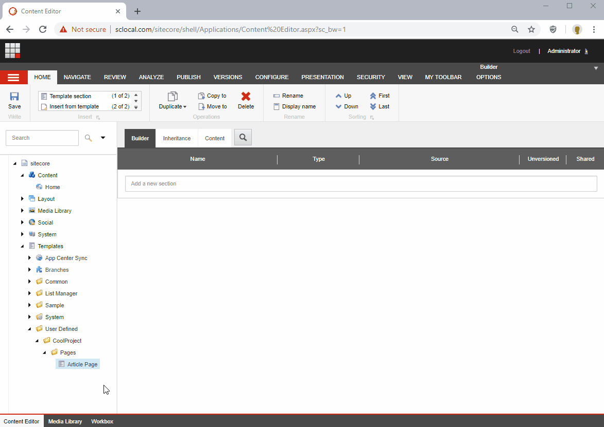

## JumpList
Component for the [Sitecore Content Editor](https://doc.sitecore.com/users/90/sitecore-experience-platform/en/the-content-editor.html) that allows to add a shortcut of an item at the top of the content tree of the content editor. This helps to access quickly to the items that you have worked recently.

### Main features
- Allows to add a shortcut of an item using the context menu.
- The shortcut opens the item and expand the content tree to show the position of the item.
- If an item is renamed, the shortcuts are updated with the new name.
- If an item is deleted, the shortcut is also removed.

### Screen recording

### Report an issue
If you have a problem to report about this component, please use this [link](https://github.com/andresvillenas/Sitecore.Extensions/issues/new), and select the label **jumplist**.