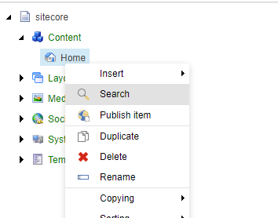

## JumpList
Component for the [Sitecore Content Editor](https://doc.sitecore.com/users/90/sitecore-experience-platform/en/the-content-editor.html) that allows to publish an item directly from the context menu of the Content Tree.

### Available since
Version 0.0.2.0

### Main features
- Allows to publish an item directly from the context menu at the content tree.

### Screen recording

### Report an issue
If you have found a problem of this component, please [create an issue](https://github.com/andresvillenas/Sitecore.Extensions/issues/new), and select the label **publish-item** before to submit it.