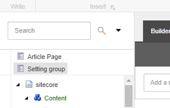
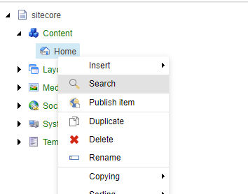

### How to install
- Download the latest version at the [releases page](https://github.com/andresvillenas/Sitecore.Extensions/releases).
- Install the package using the Installation Wizard of Sitecore.
- Enjoy 😎!

### Features
#### [JumpList](features/jumplist/jumplist.md)
 
Allows to add a shortcut of an item at the top of the content tree of the Content Editor.

#### [Publish Item in Context Menu](features/publishitem/publishitem.md)
 
Allows to publish an item directly from the context menu of the content tree.

**More features to come soon**

### Reporting bugs
Please [create a new issue](https://github.com/andresvillenas/Sitecore.Extensions/issues). It would reviewed as soon as possible.